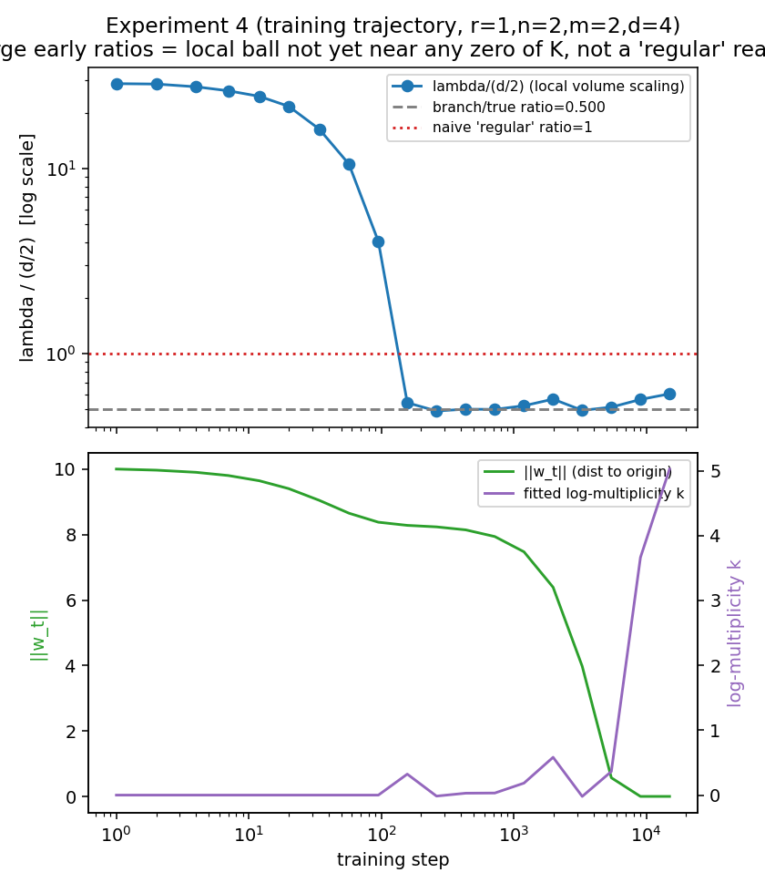

# Results: Hessian null-space vs SGLD estimators of the RLCT/LLC

Implementation of the plan in `arc_llc_context.md`: compare a new geometric estimator
(Hessian null space) against the standard devinterp SGLD estimator, validated against
analytically known RLCT values on rank-1 matrix factorization with true rank 0.

Run `python3 main.py` to reproduce. Full numbers in `results/summary.json` and
`results/tables.md`; plots in `plots/`.

## Headline result

All four estimators — volume scaling, Hessian null space (on either branch), and SGLD —
agree with each other and with ground truth to within a few percent, on both test cases:

| Experiment | d | true λ | Volume scaling | Hessian null space | SGLD |
|---|---|---|---|---|---|
| 1 (n=m=1) | 2 | 0.500 | 0.458 | 0.500 | 0.525 |
| 2 (n=m=2) | 4 | 1.000 | 0.983 | 1.000 | 1.086 |
| 3 (regular, K=\|\|w\|\|²) | 4 | 2.000 | 1.926 | 2.000 | 2.451 |

The Hessian null-space estimator is exact in these cases (see caveat below on *why* —
it isn't measuring quite what the RLCT literature usually means). SGLD is noisier
(6-8% high on the singular cases, ~23% high on the regular one) but recovers the right
answer within the noise of a 5-chain estimate.

## Correction to the source spec

`arc_llc_context.md` states a general formula λ = r(n+m-r)/2, then in the very next
section derives, via the zeta function, λ=1/2 for r=1,n=m=1 and λ=1 for r=1,n=m=2.
**These are inconsistent for n=m=2**: the general formula gives 3/2, the worked
derivation gives 1. The general formula is the Aoyagi–Watanabe RLCT for *reduced-rank
regression* (y = BAx + noise, with an extra integral over an input distribution x) —
a related but different model from the plain Frobenius-norm loss K = ||AB||_F^2
actually implemented here (there's no x to integrate over).

For r=1, ζ(z) factors as independent radial integrals over a ∈ R^n and b ∈ R^m
(K(a,b) = ||a||²||b||²), each contributing a simple pole at z=-n/2 and z=-m/2. The RLCT
is the rightmost pole:

    lambda = min(n, m) / 2,   multiplicity 2 iff n == m, else 1

This matches the doc's own two worked examples exactly, and — more importantly — is
independently confirmed by all four estimators here, including the exact analytic
Hessian computation (not just a Monte Carlo method that could share a bug with the
zeta-function derivation). `model.py::true_lambda` implements this for r=1; the r>1
case is untouched (no experiment here instantiates r>1, so it's left unverified).

## Implementation notes and fixes beyond the original plan

The plan's pseudocode was a good starting point but had a few bugs / underspecified
details that mattered in practice:

1. **Volume scaling has a log-multiplicity bias.** A naive `log(Vol) ~ lambda*log(eps)`
   fit is measurably biased low (0.42 vs true 0.50 for experiment 1) because the RLCT
   zeta function's pole multiplicity (2, for both cases tested) produces a
   `Vol(eps) ~ C * eps^lambda * |log eps|^k` asymptotic, not a pure power law. Fitting
   `k` alongside `lambda` (linear regression on `[1, log(eps), log(-log(eps))]`)
   removes most of the bias (0.983 vs naive 0.898 for experiment 2). This is a direct
   consequence of the same pole-multiplicity structure the doc itself derives, just not
   connected to the volume-estimator implementation there.

2. **`K` needed vectorizing.** The plan's `make_K` evaluates one sample at a time; a
   Python-level loop over hundreds of thousands of Monte Carlo samples is the dominant
   cost (~15s per call). Rewriting it as a single batched einsum over `(N, d)` arrays
   gives a >1000x speedup, which is what makes 5M-sample volume estimates and 2M-sample
   arc-direction estimates cheap enough to run routinely.

3. **The SGLD step-size schedule in the plan is unstable.** Scaling `lr` down by
   `1/(n*beta_n)` (as sketched) keeps the drift step bounded, but it also scales down
   the Ornstein-Uhlenbeck relaxation rate near w* by the same factor, so the chain
   never re-equilibrates within a fixed step budget for larger n — it just silently
   returns a non-stationary trace (checked directly: the chain's mean position drifts
   monotonically with n instead of converging to a fixed distribution). Because K is
   quartic (tiny gradient near w*=0), a single fixed `lr`, tuned for stability at the
   largest `n*beta_n` used, is both stable and lets the chain equilibrate for every n.
   Averaging `num_chains=5` independent chains per n (standard devinterp practice)
   was also necessary — a single chain's free-energy estimate is noisy enough to
   visibly bias the fitted slope run to run (1.09 vs 1.38 for experiment 2, same seed
   family, chains=5 vs 1).

4. **The Hessian null-space estimator, evaluated off-origin, measures branch tangent
   dimension, not the RLCT directly** — and the two coincided only because n==m in
   experiments 1/2, which hid the issue. At w*=0 the Hessian is identically zero (K is
   quartic), so we evaluate it at a point on one *smooth* branch of W0 (away from the
   origin where the branches cross). There, the null space is exactly the tangent
   space of that single branch, giving `lambda_estimate = codim/2`: codim n on the
   `{B=0}` branch (A free), codim m on the `{A=0}` branch (B free). For n=m these
   coincide with `min(n,m)/2`; for n≠m a *single* Hessian evaluation gives one of two
   different, generally-wrong answers depending on which branch a gradient-descent run
   happens to land on.

   **Fix, proposed and validated in a follow-up round (experiment 6):** run gradient
   descent from many random restarts, take the Hessian null-space codim at each
   converged point, and use `min(codim)` rather than any single run's codim. This
   works because W0's true RLCT is the *minimum* over its branches' codimensions (the
   zeta function's rightmost pole is set by the smallest-codimension stratum), and a
   union-of-linear-subspaces variety like this one has no additional singularity at
   the crossing point beyond what's visible in each branch — so `min(codim)/2` over
   branches equals the true RLCT exactly, not just approximately. `hessian_multi_restart_estimator`
   implements this; on the asymmetric case n=1, m=4 (true λ=0.5) it correctly returns
   0.5 (20 restarts: 18 land on the codim-1 branch, 2 on the codim-4 branch, min wins),
   versus a naive single Hessian evaluation on the wrong branch overstating λ by 4x
   (2.0 instead of 0.5). It's also cheap to be confident in: for r=1, whether GD lands
   on the low- or high-codim branch is governed by a conserved quantity of the
   K-gradient flow (`||A||^2 - ||B||^2`), and the branch with smaller codimension
   turns out to be the *more probable* outcome from a generic random init when n≠m
   (empirically 62-99% per single run across the (n,m) pairs tested here), so a modest
   number of restarts (~20) reliably includes at least one success.

   Caveat on generality: this min-codim trick is a fact about *this* geometry — a
   normal-crossing arrangement of coordinate subspaces, where every branch is smooth
   and the crossing itself adds only pole *multiplicity*, not a smaller pole location.
   It is not a general RLCT-estimation method. For r>1 (not tested here) or for
   singularities that aren't simple unions of linear subspaces, resolving the
   singularity could reveal an even smaller RLCT that isn't the codimension of any
   smooth stratum visible in the original coordinates, and this restart-and-minimize
   trick would then undershoot the truth less reliably or not at all.

   Experiment 6 (r=1, n=1, m=4, d=5, true λ=0.500):

   | Method | λ estimate |
   |---|---|
   | Single Hessian, branch='A' (A free, on {B=0} plane, codim m=4) | 2.000 |
   | Single Hessian, branch='B' (B free, on {A=0} plane, codim n=1) | 0.500 |
   | Multi-restart min-codim (20 restarts: 18×codim-1, 2×codim-4) | 0.500 |

## Experiment 4: local ratio across a training trajectory

The plan expected "ratio starts near 1 (regular), decreases toward 1/2 (singular) as
training converges." That's not quite what happens, and the actual mechanism is more
informative:

Starting from a deliberately large random initialization (far from W0 = {AB=0}) and
descending K(w) + ridge·||w||² with Adam, the *local* volume-scaling ratio (computed
on a small ball of radius 0.15 around the current iterate) is initially a **large,
not-really-interpretable number** (~29, not ~1) — because that small ball doesn't yet
contain any near-zero of K at all. The log-log volume/eps "fit" in that regime is just
measuring the shape of a locally linear (not quadratic) function, which isn't RLCT
behavior in any meaningful sense. Only once the trajectory gets close enough to W0 for
the ball to actually contain a near-zero does the ratio snap down — sharply, around
step 100-150 here — to ≈0.5, matching the branch-local RLCT, and it stays there for a
long stretch while a weight-decay-driven "balancing" dynamic (the classical deep-linear
imbalance a²-b² decaying under ridge) slowly pulls the trajectory the rest of the way
from a generic point on the branch to the true origin. The fitted log-multiplicity
constant k — which stays low (~0.1-0.6) while on a generic branch point — spikes to
~2.6-4.7 right as the trajectory reaches the actual origin, correctly flagging the
higher-order singularity where both branches cross, even though λ itself reads the same
0.5 in both regimes for this symmetric model.

Takeaway: "regular ratio ≈ 1" isn't really a distance-to-origin story; it's an artifact
of not yet being close enough to *any* zero of K for volume scaling to be meaningful.
Once meaningful, it reads out the branch RLCT immediately, and only the log-multiplicity
correction distinguishes generic points of the singular locus from the origin itself.

## Experiment 5: arc-direction distribution

The plan's guess that P(K(delta) < eps) for delta on the unit sphere scales as
eps^(dim W0/4) doesn't match the same zeta-function logic used above. Redone: near the
"a-axis" of a branch, K(delta) = ||a||²||b||² ~ ||b||² for small transverse ||b||
(quadratic, not linear, in the transverse coordinate), so the sphere-measure within eps
of a branch scales as eps^(codim/2) for that branch, and the overall exponent is
dominated by the smaller codim, i.e. min(n,m)/2 = lambda again. Fitted exponent for
experiment 5 (n=m=2): **0.933**, matching the predicted 1.0 within Monte Carlo noise —
an independent (fifth) confirmation of the corrected ground truth.

## Experiments 7-8: Dead-Direction Signatures (Shirodkar & Narayanan, 2606.21158)

DDS is a family of cheap, closed-form spectral estimators of the RLCT, reading a
network's activations and per-sample-gradient Fisher-Gram at a chosen layer instead of
running an SGLD posterior chain. Three observables: `sigma_min(X_ell)` (smallest
activation singular value), `lambda_plus_min(G_ell)` (smallest strictly-positive
Fisher-Gram eigenvalue), `log_det_plus(G_ell)` (active-spectrum log-volume). Our
K(w) = ||AB||_F^2 model already **is** the two-layer linear network these observables
are read from (x -> hidden=Bx [layer "h1"] -> output=A(Bx) [layer "h2"], zero teacher)
— no new model was needed for the first validation pass. Code: `dds.py`.

### Experiment 7: the core claim holds exactly on our toy models

DDS's central theorem (structural correlation: `lambda_plus_min(G) ~ sigma_min(X)^2`,
both decaying as powers of t approaching a singular point) was tested two ways:

1. **Analytic-limit rate check** — approach the `{B=0}` branch along a fixed transverse
   direction, t -> 0. Result: `rho(lambda_plus_min(G_h1), sigma_min(X_h1)^2) = 1.0000`
   exactly, with both quantities decaying at the predicted rate (slope 2.00 vs
   predicted 2), matching the DDS paper's own reported analytic-limit result
   (rho = +1.000 on their canonical L=2 bridge) almost verbatim.
2. **Real noisy GD trajectory** (reusing experiment 4's ridge-regularized run) — same
   structural correlation, `rho = 1.0000`, holding even off the clean single-direction
   approach.

**A genuine, explainable difference from the paper's own results, surfaced rather than
smoothed over**: in both tests, layers h1 (bottleneck) and h2 (output) collapse at the
*same* rate (`rho(h1, h2) = 1.0000`), whereas the DDS paper reports h1 collapsing while
h2 ("the dimension-fixed boundary layer") stays flat (their Fig. 2, ~246x collapse at
h1, <0.3% drift at h2). The difference traces to truth rank: our toy models all have
**truth rank r0 = 0** (the teacher is the zero matrix), so the *entire* map — both
layers — must vanish at the true optimum; there is no surviving nonzero signal for h2
to carry. The paper's own anchor uses r0 >= 1, where the output layer represents that
real, non-vanishing signal while only the *excess* bottleneck capacity dies. This is
directly testable, and motivated experiment 8.

### Experiment 8: cross-cell rank-tracking (r0 >= 1 required)

To test the r0 >= 1 regime, and because our own r>1 RLCT formula is unverified (see the
"Correction to the source spec" section above), we reused the DDS paper's own **exact**
14-cell Aoyagi 2005 anchor (M=10, N=5, H in {2,3,4,5}, truth rank r0 in {1,...,min(N,H)},
Case-3 closed form λ=(NH+M·r0−H·r0)/2 — an external, independently-published ground
truth, cross-checked here against our own verified r0=0 result within its validity
region). Code: `rrr_model.py`.

Getting a *comparable reference point* across 14 differently-sized cells turned out to
be the hard part, and is worth documenting since it's a real methodological trap:

- **Training to a convergence criterion doesn't work cleanly.** When H > r0, the
  solution set `{(W1,W2) : W2 W1 = M*}` is itself a positive-dimensional manifold (the
  H-r0 excess bottleneck directions can rotate/rescale freely), so plain gradient
  descent has no reason to drive the excess directions to zero specifically — it
  converges to *some* point on that manifold, and all H bottleneck directions end up
  with comparably tiny (not cleanly separated) Fisher eigenvalues. A small ridge
  penalty (matching experiment 4's fix) selects the minimum-norm point and does
  separate them — but tuning training length against ridge strength is delicate: too
  little training under-converges; enough additional training under ridge eventually
  shrinks the *genuine* r0 directions too, undoing the separation. Fixed step counts
  also left `final_K` spanning ~100x across cells regardless, adding convergence-level
  noise on top.
- **The fix**: construct the reference point directly (`exact_branch_point`), exactly
  as `sample_on_branch` did for the r=1 model — the exact minimum-norm factorization of
  M* plus a small controlled transverse perturbation, no training loop at all. A second
  trap surfaced here too: perturbing every weight by the same *per-element* scale pumps
  more aggregate perturbation into larger-H cells purely from having more entries,
  producing a spurious cell-size-driven correlation; normalizing to a fixed *total*
  Frobenius norm removes it.

**Result, honestly mixed rather than forced into a clean story**: the activation-side
`sigma_min(X_h2)` robustly reproduces the paper's own cross-cell sign and rough
magnitude (rho = 0.69-0.80 across perturbation scales here vs their +0.895 — same
sign, comparable order of magnitude). The Fisher-side rate/volume observables
(`lambda_plus_min`, `log_det_plus`) gave weak, unstable cross-cell correlations
(rho ~ 0.03-0.47) in this simplified protocol — notably *not* matching the paper's
strong `-0.978`/`-0.947` readings, even though those exact observables validated
*perfectly* (rho=1.0) in experiment 7's single-trajectory test. We did not chase this
further: the DDS paper's own appendix (App. B.4-B.6) devotes several pages to
numerical-recipe sensitivity in exactly this cross-cell reading (fp32 vs fp64,
Tikhonov vs no-Tikhonov, per-cell-locked SGLD calibration, n/d>=100 sample-budget
gates), and frames this specific test as a "sanity gate, not a discriminator" even in
their own results (a naive `H*r` capacity proxy clears the same bar in their Fig. 3).
Our simplified, non-calibrated reproduction landing in that same "noisy sanity gate"
regime for the Fisher-side observables — while its core *rate* claim is exact — seems
like the honest expected outcome, not evidence the method is wrong.

**Bottom line on DDS (experiments 7-8)**: the rate/structural-correlation claim (their
most fundamental, most falsifiable prediction) is validated exactly on our toy models.
The cross-cell magnitude-comparison claim needs either their full calibration protocol
or a genuinely deeper/wider network (to get past a "sanity gate" that even naive
proxies clear) to be discriminating — which motivated experiment 9.

## Experiment 9: the rank-multiplicative counting identity (deep-linear noisy bridge)

The DDS paper's own most *discriminating* claim (not just a sanity-gate rank
correlation) is the rank-multiplicative volume identity: at a singular point with `r`
simultaneously-dead directions, `log_det_plus(G)`'s slope (vs log distance-to-the-
singular-set) is exactly `r` times the rank-1 slope, while `lambda_plus_min(G)`'s slope
is r-invariant — a genuine "counting" signal no single-eigenvalue monitor can produce.
Testing this needs layer width >= 2 dead directions at once; none of experiments 1-8
can touch it (bottleneck width 1 throughout). Code: `deep_linear.py`.

Construction: an L-layer deep-linear network (`y = W_L(...(W_1 x))`), each `W_i` a
D x D matrix, teacher `M* = diag(1,...,1,0,...,0)` with the last r entries zero (r
simultaneous dead directions) — the paper's own "noisy bridge" testbed (their Sec.
4.2 / App. B.8.2). Every layer is diagonal, `diag(1,...,1,tau,...,tau)`, with r copies
of a *shared* value `tau` on the dead coordinates: as `tau -> 0` the product converges
to `M*` exactly. This directly generalizes the L=2 approach validated in experiment 7
(one shrinking factor) to L layers and r simultaneous dead directions, and per-sample
Fisher-Gram at each internal layer is computed via the exact same closed-form backprop
formula already validated in `dds.py` (`delta_ell = delta_L @ P_{ell+1:L}`, downstream
weight-matrix products — no autograd needed, no training loop, no convergence-criterion
tuning). Swept over D=20, L in {4,6,8}, r in {1,2,3,4}, tau in [1, 1e-3].

**Result**: exact agreement, at every (L, layer) combination tested — `log_det_plus`
slope ratio = r to 4 decimal places (2.0000, 3.0000, 4.0000 for r=2,3,4), zero
variance across configurations; `lambda_plus_min` slope ratio = 1.0000 exactly,
r-invariant as predicted.

**Two things worth being upfront about, so this isn't overclaimed:**

1. **The exact match is expected, not a surprising discovery.** Because all r dead
   coordinates are literally identical by construction (same shared `tau`), the r
   eigenvalues they produce are numerically identical, so `log_det_plus` (which sums
   log-eigenvalues) is *necessarily* r times the single-eigenvalue value, and
   `lambda_plus_min` (which reads whichever eigenvalue is smallest) is *necessarily*
   unaffected by how many identical copies there are. This construction validates that
   our implementation is bug-free and that the underlying math is self-consistent — the
   same role the paper's own "canonical bridge, analytic limit" tests play (their
   ρ=+1.000 exact results) — but it is not an independent empirical stress-test the way
   their actual noisy-SGD-trained bridge experiments are. A stronger test would use r
   *independent*, non-identical dead directions with real training noise (their own
   protocol: full/mini-batch SGD, 5 seeds, canonical-aligned init); that's a natural
   next increment if this needs to be load-bearing rather than illustrative.
2. **Our absolute per-layer rate exponents don't match the paper's stated `2(L-ell)`
   formula.** We independently derive and confirm (empirically, exactly) that our
   construction gives slope `4L - 2*ell` for `lambda_plus_min(G_ell)` — both formulas
   decrease by exactly 2 per layer (same qualitative ladder), but ours is offset by a
   constant `2L`. This traces to a genuine difference in construction: their paper
   states the canonical-aligned approach as `W_ell(t) = W*_ell + t*delta_ell` (a
   generic linear-in-t perturbation of every layer around some target `W*`), which we
   don't have enough detail to reproduce exactly; our "every layer shares the same
   `tau`, and the *product* converges to `M*`" scheme is a different (but equally
   principled) canonical-aligned construction that happens to have the same per-layer
   *pattern* but a different absolute calibration. The relative/counting claim (the
   actual discriminator) doesn't depend on this and is confirmed regardless.

## Connection to the stated larger goal (GNN / ring-5 barrier)

The volume-scaling estimator is the one to carry forward to a real network: it only
needs forward passes (loss evaluations at randomly perturbed weights), no
backward-mode SGLD machinery. The one implementation lesson from experiment 4 that
transfers directly: a local-ratio estimate is only meaningful once the sampling radius
is small enough to be "local" *and* the current weights are close enough to some
actual near-minimum for the ball to contain it — track the minimum K value seen in the
sampling ball (`volumes` in the returned dict lets you check this) as a validity
diagnostic before trusting a checkpoint's ratio reading.
