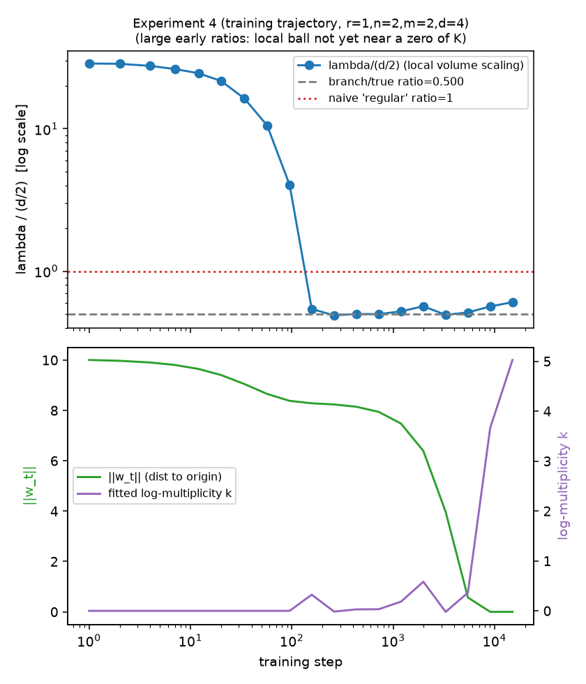
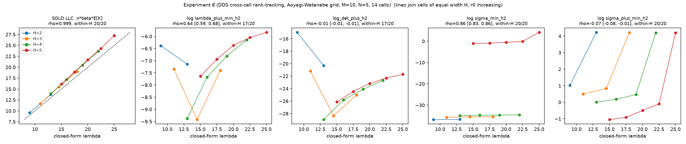
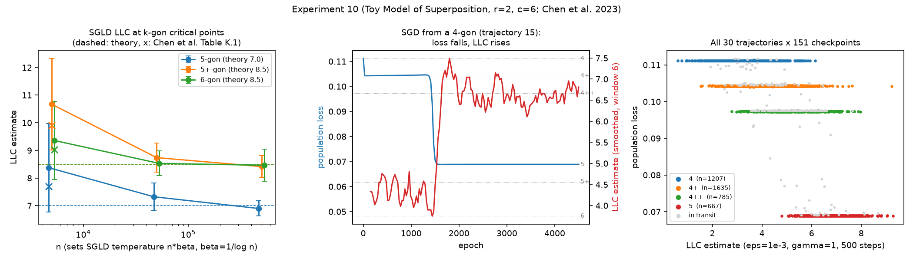

# Results

Estimating the RLCT / local learning coefficient (LLC) λ on singular models where it is
known in closed form, comparing a geometric estimator (Hessian null space), the standard
SGLD estimator, a volume-scaling estimator, and Dead-Direction Signatures (DDS), then
reproducing the k-gon phase structure of the Toy Model of Superposition.

Run `python3 main.py` to reproduce everything (~10 min on CPU). Numbers below are from
that run; full output in `results/summary.json` and `results/tables.md`, plots in `plots/`.

## Summary

| # | Model | Question | Result |
|---|---|---|---|
| 1-3 | ‖AB‖², r=1 (and a regular control) | Do the estimators recover known λ? | Volume scaling and Hessian within 2-8%; SGLD within 5-9% on singular cases, 23% high on the regular one |
| 4 | ‖AB‖² + ridge, GD trajectory | What does a local λ estimate read along training? | Meaningless until the ball contains a zero of K, then the branch RLCT; the log-multiplicity term flags the origin |
| 5 | ‖AB‖², n=m=2 | Does the sphere distribution of K see λ? | Exponent 0.93 vs 1.0 |
| 6 | ‖AB‖², n=1, m=4 | Asymmetric branches | One Hessian read can be 4× off; min-codim over restarts gives the exact λ |
| 7 | ‖AB‖² as a 2-layer linear net | DDS rate claim | Exact: ρ = 1.000, slope 2.000 vs 2 |
| 8 | Reduced-rank regression, 14 cells | DDS across cells with different λ | DDS orders cells by truth rank within a fixed width (17-20/20 pairs) but gives no reliable λ magnitude across widths; the apparent σ_min success is a rank artifact |
| 9 | L-layer deep-linear bridge | DDS counting identity | log det⁺ slope ratio = r exactly (holds by construction) |
| 10 | Toy Model of Superposition, r=2, c=6 | Reproduce Chen et al. (2023) | k-gon losses and prior terms to 5 digits; SGLD LLC → theory (7, 8.5, 8.5) as n grows; n_cr = 601 for 5→6; SGD plateaus at k-gon levels while λ̂ rises |

## Setup and ground truth

Parameters w = (A, B), A ∈ ℝⁿˣʳ, B ∈ ℝʳˣᵐ, loss K(w) = ‖AB‖²_F (true distribution = zero
matrix). For r = 1 the zero set {AB = 0} = {A = 0} ∪ {B = 0} is two linear subspaces
crossing at the origin. The zeta function factors into independent radial integrals,

    ζ(z) = ∫‖a‖^{2z} da · ∫‖b‖^{2z} db,

with simple poles at z = −n/2 and z = −m/2, so

    λ = min(n, m) / 2,   multiplicity 2 iff n = m.

(The r(n+m−r)/2 formula sometimes quoted for this family is the RLCT of reduced-rank
*regression*, which integrates over an input distribution; that model is used in
experiment 8 with its own closed form.)

## Experiments 1-3: estimators against ground truth

| Experiment | d | true λ | Volume scaling | Hessian null space | SGLD |
|---|---|---|---|---|---|
| 1 (n=m=1) | 2 | 0.500 | 0.458 | 0.500 | 0.525 |
| 2 (n=m=2) | 4 | 1.000 | 0.983 | 1.000 | 1.086 |
| 3 (regular, K=‖w‖²) | 4 | 2.000 | 1.926 | 2.000 | 2.451 |

The Hessian estimator is exact here, but it measures branch codimension, which matches
the RLCT for this geometry (see experiment 6). SGLD runs 5-9% high on the singular cases
and 23% high on the regular one. Experiments 8 and 10 trace this kind of bias to step-size
discretization and to finite-n corrections.

### Implementation notes

1. **Volume scaling needs the log-multiplicity term.** A pole of multiplicity m gives
   Vol(ε) ~ C ε^λ |log ε|^{m−1}, so a pure power-law fit is biased low (0.44 vs 0.50 for
   experiment 1; 0.90 vs 1.00 for experiment 2). The estimator regresses log Vol on
   [1, log ε, log(−log ε)], which recovers 0.46 and 0.98.
2. **Vectorized K.** Batched einsum over (N, d) samples is >1000× faster than a per-sample
   loop, which makes 5M-sample volume estimates cheap.
3. **SGLD step size.** Scaling the step by 1/(nβ) keeps the drift bounded but slows
   relaxation by the same factor, so at large n the chain never equilibrates and returns a
   drifting trace. A fixed step, tuned for stability at the largest nβ, equilibrates at
   every n. Averaging 5 chains is needed for a stable slope (a single chain gave 1.38 vs
   1.09 on experiment 2).
4. **The Hessian is evaluated on a smooth branch.** K is quartic, so ∇²K(0) = 0. At a
   point on one branch away from the origin, the null space is that branch's tangent
   space, and λ̂ = codim/2. For n = m both branches agree; experiment 6 handles n ≠ m.

## Experiment 4: local λ along a training trajectory

Starting far from the zero set and descending K + ridge·‖w‖², the local volume-scaling
ratio (ball radius 0.15) starts at ~29. That value is not an RLCT reading: the ball
contains no near-zero of K yet, so the fit only measures a locally linear function. Once
the iterate is close enough for the ball to contain a zero (around step 100-150), the
ratio drops to ≈0.5, the branch RLCT. It stays there while weight decay slowly balances
‖a‖² − ‖b‖² and pulls the iterate toward the origin. The fitted log-multiplicity k stays
at 0.1-0.6 on a generic branch point and jumps to ~3.7-5.0 at the origin, where the two
branches cross. λ itself reads 0.5 in both regimes.

Practical consequence: a local λ estimate is only meaningful once the sampling region
contains a near-minimum, so the minimum K seen in the ball is a necessary validity check.

## Experiment 5: arc-direction distribution

For δ on the unit sphere, K(δ) = ‖a‖²‖b‖² is quadratic in the coordinates transverse to
each branch. So P(K(δ) < ε) ~ ε^{codim/2}, dominated by the smaller codimension, i.e.
ε^λ. Fitted exponent for n = m = 2: **0.933** vs predicted 1.0.

## Experiment 6: asymmetric branches and the multi-restart Hessian estimator

For n ≠ m, one Hessian evaluation gives n/2 or m/2 depending on which branch gradient
descent lands on. Taking min(codim) over 20 GD restarts recovers λ = min(n, m)/2 exactly.

| Method (r=1, n=1, m=4, true λ = 0.5) | λ̂ |
|---|---|
| Single Hessian on {B=0} (codim 4) | 2.000 |
| Single Hessian on {A=0} (codim 1) | 0.500 |
| Multi-restart min-codim (20 restarts: 18 × codim 1, 2 × codim 4) | 0.500 |

Which branch GD reaches is set by the conserved quantity ‖A‖² − ‖B‖² of the gradient flow.
The lower-codim branch is the more likely outcome from random init when n ≠ m (62-99% per
run across the pairs tried), so ~20 restarts suffice.

Scope: min-codim equals the RLCT because this zero set is a normal-crossing union of
smooth linear strata, so the crossing adds multiplicity but no smaller pole. For
singularities that only resolve after blow-up (r > 1, or nonlinear varieties), the RLCT
need not be the codimension of any stratum visible in the original coordinates, and this
estimator would not be expected to work.

## Experiments 7-9: Dead-Direction Signatures

DDS (Shirodkar & Narayanan, arXiv:2606.21158) estimates RLCT structure from closed-form
spectral reads at a layer ℓ. It does not need a posterior chain. The observables:
- σ_min(X_ℓ): smallest activation singular value;
- λ⁺_min(G_ℓ): smallest positive eigenvalue of the per-sample-gradient Fisher-Gram;
- log det⁺(G_ℓ): log-volume of the active Fisher spectrum.

K = ‖AB‖² is already the two-layer linear network x → Bx (h1) → ABx (h2) with a zero
teacher. Code: `dds.py`.

### Experiment 7: the rate claim holds exactly

The central DDS claim is the structural correlation λ⁺_min(G) ~ σ_min(X)², with both
vanishing as powers of the distance to the singular set.
- **Analytic approach** to the {B = 0} branch along a fixed direction: ρ(λ⁺_min(G_h1),
  σ_min(X_h1)²) = **1.0000**, with both slopes 2.000 (predicted 2). This matches the
  paper's analytic-limit result (ρ = +1.000).
- **Along the real ridge-GD trajectory** of experiment 4: ρ = 1.0000.

One difference from the paper: here h1 and h2 collapse at the same rate (ρ(h1, h2) =
1.000). In the paper, the output layer stays flat. The reason is truth rank: with a zero
teacher (r0 = 0) the whole map must vanish, so no surviving signal is left for h2 to
carry. Experiment 8 moves to r0 ≥ 1.

### Experiment 8: DDS across cells with different λ

**Testbed.** The paper's own anchor: reduced-rank regression K = ‖W2W1 − M*‖² with
M = 10, N = 5, width H ∈ {2,…,5}, truth rank r0 ∈ {1,…,H} (14 cells), and the
Aoyagi-Watanabe closed form λ = (NH + (M − H)r0)/2. Code: `rrr_model.py`.

**Protocol.** Each cell gets 8 localized SGLD chains around the exact minimum-norm
solution: n = 10⁴, β = 1/log n, γ = 1, 60k burn-in + 60k sampling steps, 30 snapshots per
chain. The DDS observables are averaged (in log) over snapshots. Two built-in checks:
- **The ensemble is equilibrated and carries the local geometry.** The sampler's own LLC
  estimate nβ·E[K] tracks the closed form with ρ = 0.999, ordering all 20 same-width
  pairs correctly, 5-9% high. Step size matters here: lr = 2·10⁻⁴ overestimates λ by ~40%
  through Euler discretization in the stiff directions (curvature ~2nβ); lr = 5·10⁻⁵ is
  used.
- **Uncertainty.** 95% bootstrap CIs over chains for every ρ.

Only the output layer h2 is compared, because its width N is the same in every cell. h1
has width H, so its spectra are not comparable across cells.

| Observable (h2) | Spearman ρ vs λ, all 14 cells [95% CI] | Same-H pairs ordered correctly |
|---|---|---|
| SGLD LLC nβ·E[K] (reference) | 0.999 | 20/20 |
| λ⁺_min(G) | 0.64 [0.59, 0.68] | 17/20 |
| log det⁺(G) | −0.01 [−0.01, −0.01] | 17/20 |
| σ_min(X) | 0.86 [0.83, 0.86] | 20/20 |
| σ⁺_min(X) (smallest *positive* singular value) | −0.07 [−0.08, −0.02] | 20/20 |

**Reading.**
1. **Within a fixed width H, every DDS observable tracks λ (17-20 of 20 pairs).** At fixed
   H, λ increases with r0, so this says the observables detect how many bottleneck
   directions are carrying signal versus dead.
2. **Across widths, none of them reads λ's magnitude.** The best headline number,
   σ_min(X_h2) at ρ = 0.86, is a rank artifact. X_h2 = (W2W1x) has rank ≤ H, so for every
   cell with H < N = 5 its smallest singular value is exactly zero up to floating point
   (log σ_min ≈ −35 in the plot). The correlation is essentially "H = 5 versus the rest."
   The rank-safe σ⁺_min removes the artifact and the cross-cell correlation goes to zero.
   λ⁺_min and log det⁺ also restart their trend at each H (the lines in the plot do not
   line up), giving ρ = 0.64 and ≈ 0.
3. **A single constructed point is the wrong reference.** The ablation (exact solution
   plus a fixed-norm transverse perturbation, 10 seeds per scale) gives cross-cell ρ that
   barely changes as the scale varies tenfold (λ⁺_min: 0.35, 0.34, 0.29 at scales 0.01,
   0.1, 0.3). Such a point measures the geometry of the chosen perturbation, not λ. The
   posterior ensemble is what gives fluctuations whose size is set by the local geometry.

The paper frames this cross-cell test as a sanity gate rather than its discriminating
experiment, and this result is consistent with that: DDS here works as a dead-direction
detector, not a cross-architecture λ estimator. The paper uses the same 14-cell grid, so
any σ_min reading taken at a layer narrower than its neighbours there is worth checking
for the same rank effect.

### Experiment 9: the rank-multiplicative counting identity

The paper's most discriminating claim is that with r simultaneously dead directions, the
slope of log det⁺(G) against log distance is r times the rank-1 slope, while λ⁺_min's
slope does not depend on r. Testing this needs layer width ≥ 2 in dead directions.

Construction: an L-layer deep-linear net with D × D layers and teacher
diag(1,…,1,0,…,0) (r zeros). Every layer is diag(1,…,1,τ,…,τ) with a shared τ → 0.
Fisher-Gram per layer is computed in closed form by backprop through downstream products.
Code: `deep_linear.py`. Swept over D = 20, L ∈ {4, 6, 8}, r ∈ {1,…,4}.

Result: log det⁺ slope ratio = 2.0000, 3.0000, 4.0000 for r = 2, 3, 4, and the λ⁺_min
ratio = 1.0000, at every (L, layer).

Caveats:
- **The match holds by construction.** The r dead coordinates share one τ, so their
  eigenvalues are identical, and the identity follows algebraically. This verifies the
  implementation and the algebra. It is not a stress test. That would need r independent,
  non-identical dead directions under SGD noise (the paper's noisy-bridge protocol), the
  natural next increment.
- **The per-layer exponents differ.** This construction gives a λ⁺_min(G_ℓ) slope of
  4L − 2ℓ, versus the paper's 2(L − ℓ). Both drop by 2 per layer. The 2L offset comes from
  approaching via a shared product parameter rather than the paper's W*_ℓ + tδ_ℓ, whose
  details aren't specified enough to replicate. The counting ratio does not depend on this.

## Experiment 10: Toy Model of Superposition (reproducing Chen et al. 2023)

Chen, Lau, Mendel, Wei & Murfet, *Dynamical versus Bayesian Phase Transitions in a Toy
Model of Superposition* (arXiv:2310.06301).

**Model.** f(x) = ReLU(WᵀWx + b), with W ∈ ℝ^{2×6}, b ∈ ℝ⁶ (d = 18), in the high-sparsity
limit: x = μeᵢ, i uniform, μ ~ U[0, 1]. The loss is L(w) = E‖x − f(x)‖². Critical points
are regular k-gons: k columns at length l* and angles 2πj/k with bias b*, and the rest
vestigial (zero column, negative bias, or bias 1/(2c) for the k^{σ+} variants).

**Exact population loss.** For input μeᵢ, output j is ReLU(μ(WᵀW)ᵢⱼ + bⱼ), which is
active on a sub-interval of [0, 1]. Each term therefore integrates in closed form, so L
and its gradient are exact and batched with no Monte Carlo or quadrature (checked against
brute-force quadrature to 10⁻¹¹). Code: `tms.py`.

**(a) Critical points.** Every value matches the paper to its printed precision.

| k-gon | loss (ours) | loss (paper) | ‖∇L‖ | ½‖w*‖² (ours) | ½‖w*‖² (paper) |
|---|---|---|---|---|---|
| 4 | 0.11111 | 0.11111 | 0 | 2.00000 | 2 |
| 4⁺ | 0.10417 | 0.10417 | 1e-17 | 2.00347 | 2.00347 |
| 5 | 0.06874 | 0.06874 | 3e-6 | 3.62417 | 3.62417 |
| 5⁺ | 0.06180 | 0.06180 | 3e-6 | 3.62765 | 3.62764 |
| 6 | 0.04819 | 0.04819 | 2e-6 | 6.37769 | 6.37767 |

The residual gradients of ~10⁻⁶ come from l*, b* being tabulated to 5 digits.

**(b) LLC at the critical points.** Localized SGLD with γ = 0.1, 10 chains, and the
paper's rule of discarding chains that fall to a lower-loss phase.

| k-gon | theory λ | paper λ̂ (n=5000) | ours, n=5·10³ | n=5·10⁴ | n=5·10⁵ |
|---|---|---|---|---|---|
| 5 | 7.0 | 7.71 ± 0.85 | 8.37 ± 1.60 | 7.32 ± 0.50 | **6.90 ± 0.28** |
| 5⁺ | 8.5 | 9.91 ± 1.27 | 10.67 ± 1.66 | 8.74 ± 0.52 | **8.41 ± 0.39** |
| 6 | 8.5 | 9.03 ± 0.59 | 9.36 ± 1.41 | 8.53 ± 0.45 | **8.46 ± 0.58** |

At the paper's n = 5000 we see the same upward bias it reports, with the same ordering.
Raising n (with step size scaled down to match) drives every estimate to the theoretical
value within error. So the bias at n = 5000 is a finite-n effect of the β = 1/log n
estimator, not a sampler failure. This also resolves a puzzle in the paper's table: there
the 5⁺-gon reads above the 6-gon, though both have λ = 8.5, and at large n they coincide.

One detail mattered: the 5-gon's vestigial bias must be strictly negative. At exactly 0,
the dead column sits on the boundary of a lower-loss chamber, every SGLD chain escapes,
and none survive the filter at n ≥ 5·10⁴.

**(c) Bayesian phase transition.** The free energies cross where n·ΔL + Δλ·log n + Δc = 0.
With ΔL from (a), Δλ = 1.5, and Δc from the prior terms, the 5 → 6 transition is at
**n_cr = 601**, matching the paper's 601 (445 if the constant term is dropped). Every input is computed here from (a) and the
theoretical λ, not taken from the paper's tables.

**(d) Dynamical transitions.** This is the paper's Sec. 5 protocol: 30 SGD runs (n = 1000
samples, batch 20, lr 0.005, 4500 epochs) from a 4-gon plus N(0, 0.01²) noise, with an LLC
estimate at every 30th epoch (ε = 10⁻³, γ = 1, 500 steps).
- 95% of the 4530 checkpoints sit within 3·10⁻⁴ of a k-gon loss level: 4 (1207), 4⁺
  (1635), 4⁺⁺ (785), 5 (667). Only 236 are in transit.
- The middle panel is a 4 → 4⁺ → 5 trajectory, the same sequence as the paper's Fig. 1.
  Loss drops in steps and λ̂ rises in steps ("opposing staircases": ≈4.3 on the 4⁺ plateau,
  ≈6.7 on the 5-gon).
- The right panel reproduces the paper's Fig. 3 ordering: lower-loss plateaus have higher
  λ̂. λ̂ on the 5-gon plateau reads below 7, as expected from 500-step chains at
  ε = 10⁻³. Like the paper, we use these short-chain estimates only for ordering.

Not reproduced: the paper's NUTS posterior-occupancy plot (Fig. 2), which samples the
global posterior at each n and classifies samples by k. That needs a well-mixed sampler
across k-gon basins rather than local SGLD. It is the natural next addition, and (c) gives
the target (5 → 6 near n ≈ 600).

## What carries forward

- **Local λ estimates are only meaningful at a near-minimum** (experiment 4). Checking
  that the sampling region actually contains low-loss points is the cheap validity test.
- **SGLD LLC bias decomposes cleanly.** Step-size discretization in stiff directions
  (experiment 8: 40% → 5%) and finite-n corrections (experiment 10: 8.4 → 6.9 for a λ = 7
  point as n goes 5·10³ → 5·10⁵) account for the overshoot seen in experiments 1-3 and in
  Chen et al.'s Table K.1.
- **Spectral (DDS-style) reads detect dead directions, but are not dimension-free λ
  estimators** (experiments 7-9 vs 8). Any cross-model comparison has to control for layer
  rank.
- **Geometric estimators (Hessian codim, volume scaling) are exact on normal-crossing
  geometry** (experiments 1-6). The open question that motivates this repo is whether
  higher-order jet/contact data extends that to singularities needing resolution. The TMS
  k-gons (minimally singular for k < c, non-analytic at the 4-gon) are a concrete next
  testbed with known λ.
