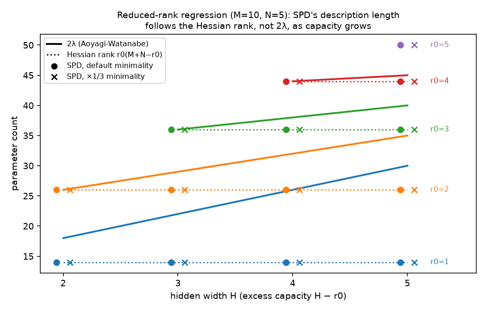

# SPD vs λ on reduced-rank regression and matrix factorization

Pre-registered in [`PREREGISTRATION.md`](PREREGISTRATION.md) (frozen 2026-10-01 22:26,
two dated amendments, hashes in `PREREGISTRATION.sha256`).

## Question

On TMS 5→2 (`../RESULTS.md`) the critical points are Morse–Bott, so λ = (Hessian rank)/2
and the two can't be separated. Here they come apart. In a two-layer linear network
y = W₂W₁x with hidden width H and a rank-r0 teacher, unused capacity (H > r0) raises λ
but not the Hessian rank:

- 2λ = NH + (M − H)r0 (Aoyagi-Watanabe), rising with H;
- Hessian rank = r0(M + N − r0), flat in H.

Which one does param-decomp's SPD decomposition follow?

## Setup

- **Grid:** M = 10, N = 5, every Case-3-valid cell with H ≥ 2 and r0 ≥ 1 (14 cells).
- **Target:** the exact minimum-norm solution, the point where experiment 8's SGLD
  recovered λ.
- **Trainer:** param-decomp's JAX trainer, unmodified. It is run through a driver that
  patches the TMS forward to be linear M → H → N.
- **Settings:** TMS 5-2 settings otherwise, C = 20 per site, untied sites, two
  importance-minimality coefficients (default and ×1/3). That gives 28 runs.

## Result: all pre-registered predictions hold, in 28/28 runs

| H | r0 | SPD alive L1/L2 (both coeffs) | DL_fn = k(M+N−k) | Hessian rank | 2λ |
|---|---|---|---|---|---|
| 2 | 1 | 1/1 | 14 | 14 | 18 |
| 3 | 1 | 1/1 | 14 | 14 | 22 |
| 4 | 1 | 1/1 | 14 | 14 | 26 |
| 5 | 1 | 1/1 | 14 | 14 | 30 |
| 2 | 2 | 2/2 | 26 | 26 | 26 |
| 3 | 2 | 2/2 | 26 | 26 | 29 |
| 4 | 2 | 2/2 | 26 | 26 | 32 |
| 5 | 2 | 2/2 | 26 | 26 | 35 |
| 3 | 3 | 3/3 | 36 | 36 | 36 |
| 4 | 3 | 3/3 | 36 | 36 | 38 |
| 5 | 3 | 3/3 | 36 | 36 | 40 |
| 4 | 4 | 4/4 | 44 | 44 | 44 |
| 5 | 4 | 4/4 | 44 | 44 | 45 |
| 5 | 5 | 5/5 | 50 | 50 | 50 |

- **P1 (exactly r0 alive components per site): holds in all 28 runs.** All runs
  converged: summed-component weight error ≤ 0.2%, and reconstruction from the alive
  components alone has relative MSE ≤ 3·10⁻⁵. The alive/dead margin is wide. Alive
  components have CI > 0.5 on 72-100% of inputs; every other component on 0.00%.
- **P2 (no dependence on H at fixed r0): holds.** The H − r0 excess hidden directions
  produce no alive component at either site, at either coefficient.
- **P3 (SPD tracks Hessian rank, not λ): holds.** DL_fn equals the Hessian rank in all 28
  runs. It differs from 2λ in all 20 runs with H > r0, by up to 16 (H = 5, r0 = 1: 14 vs
  30). The two agree only where H = r0, where there is no excess capacity and the point is
  regular.

**Matrix factorization (r0 = 0)** cannot be run (Amendment 2). The exact target is
W₁ = W₂ = 0, and param-decomp refuses to decompose a zero matrix. That outcome points the
same way: SPD has nothing to describe, and its description length is 0, while
λ = min(n, m)/2 > 0 (2λ = 5-20 on this grid). The H = 1 cells hit a trainer sharding bug
and are excluded; they have no excess capacity.

## Interpretation

- **SPD's description length is a property of the function.** A rank-r0 linear map is
  r0 rank-1 pieces, however many unused hidden units the network carries. The unused
  units get zero weight, so no component spends causal importance on them.
- **λ is a property of the parameterization around the function.** Unused capacity
  creates degenerate, quartic directions in the loss. These add to λ, by (N − r0)/2 per
  extra hidden unit, even though nothing is computed with them. The Hessian is blind to
  those directions, which is why it agrees with SPD here.
- **So on this testbed SPD tracks the Hessian rank, not λ.** Read as a description
  length (λ log n bits in SLT's free energy), λ charges *partially* for unused capacity.
  Each degenerate direction costs less than a regular parameter but more than nothing,
  because specifying "these weights are near zero" still takes some precision. SPD's
  count charges nothing for it.
- **What this does and does not show.** It does not show λ is the wrong MDL target. It
  shows SPD and λ measure different things whenever there is excess capacity. Any
  "LLC = SPD description length" correspondence would have to hold only at regular or
  Morse–Bott points (TMS, and the H = r0 cells here), where both reduce to parameter
  counting.

## Caveats

- **The prediction follows from theory, so this confirms rather than surprises.** With
  dense Gaussian inputs, SPD's minimality has nothing to separate between inputs. What the
  runs test is that SPD's actual optimizer, CI function and losses realize the
  theoretical minimum and keep no excess components alive. At both coefficients they do.
- **Only the minimum-norm target was used.** A target elsewhere on the solution manifold
  (e.g. GD without ridge, excess units non-zero but cancelled by W₂) has a different local
  λ. The excess components would then be causally inert rather than zero. Whether SPD
  still discards them is the natural next run.
- **Linear targets only.** SPD's interesting regime is sparse, input-dependent
  mechanism use. That regime is where TMS showed SPD finding descriptions *shorter* than
  the ground truth (`../RESULTS.md`).

## Files

- `run_rrr_spd.py`: driver (param-decomp venv).
- `analyze.py`: scoring.
- `plot.py`: figure.
- Run outputs: `~/rrr-spd/` (jobs list, launcher, logs, per-run `.npz`; not committed).
